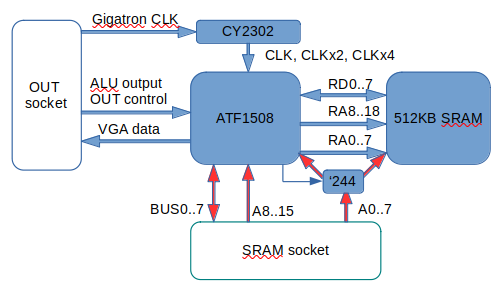
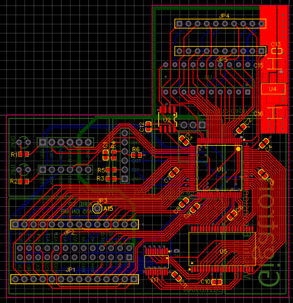
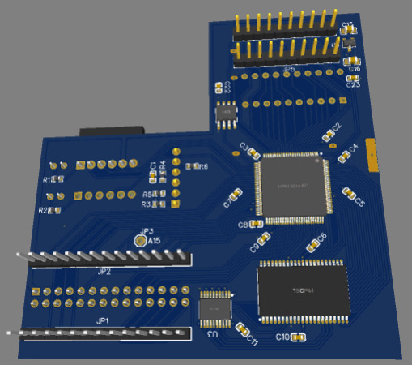
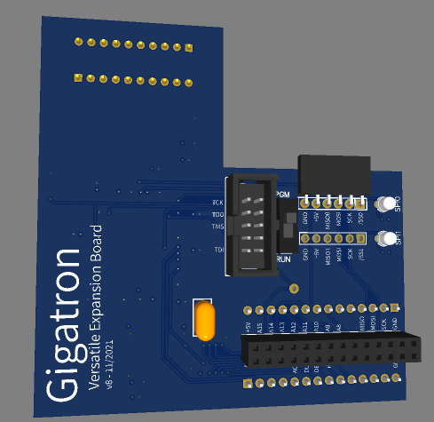

# Crazy expansion board for the Gigatron

The goal of this expansion board is to provide an easy way to
experiment with crazy expansion ideas for the Gigatron.  This is work
in progress. In fact this project may never go forward because it
looks like an infinite time sink.

## 1. Idea

The core of the board is a XC95144XL CPLD with a 100 pins package
mediating access to a fast CY7C1049G 512KB static ram.  This static
ram is fast enough to carry out multiple read and writes during each
Gigatron cycle. One of them can be used to serve the Gigatron memory
requests, the other ones can be used for many purposes such as
generating the video signal while keeping the Gigatron CPU free for
other tasks, possibly with a higher resolution than the normal
Gigatron.  Of course all depends on the CPLD program that one loads on
this board. The idea is to start with a simple program that replicates
the functionality of a normal RAM & IO expansion board, then to add
the possibility to bank all 512KB of memory --Hello Gigatron 512K,--,
then to recreate the functionality of a video repeater, then maybe to
authorize higher resolutions, etc...

This CPLD is not very powerful by today's standards. The datasheet
describes it as roughly comparable to eight 54v18 GALs. Its main
advantage is that it has 5v-tolerant i/o pins and is well supported by
old versions of the Xilinx tools which are freely available. An
alternative design (v8a) uses an ATF1508 which is a true 5v part that
is normally cheaper. While the ATF1508 may be a bette fit, in these
times of chip shortages, what matters is what is available.  The
following diagram gives an overview of the board.



In addition to the CPLD and the SRAM, there is a CY2302 zero delay PLL
that takes the 6.25MHz Gigatron clock and generates two additional
clocks at 2x and 4x the frequency with aligned phases. These clocks
can be used to split the Gigatron cycle into smaller parts and drive
the SRAM at a faster rate.

The last chip is a 74HCT244 buffer that sits between the 8 low bits
`A0..7` of the Gigatron address bus and the `RA0..7` wires that
connect the CPLD to the 8 low bits of the SRAM address bus. This was
necessary the CPLD did not have enough remaining I/O pins to receive
the full Gigatron address bus on separate lines. When the 74HCT244
outputs are active, the Gigatron `A0..7` go into both the SRAM address
bus and the CPLD ports `RA0..7`. When the 74HCT244 outputs are
tri-stated, the CPLD has exclusive control of the SRAM address bus. Of
course one has to be careful to tri-state these CPLD ports and to use
them as inputs when the 74HCT244 has active outputs.


## 2. Layout

The board layout places all the SMT components out-of-sight on the
back side od the board. The visible side contains two connectors for
SPI devices using the SD Card breakout pinout, a JTAG connector to
program the CPLD, an expansion connector with 28 pins, and a good old
74HCT377 near the OUT register which is there for nostalgia and also
because it was available.








## 3. Usage

Althouth the extension header has more signals and a different layout, this board is backward compatible with the latest version "dual drive" of the [GAL based extension board](../extension-retro). The following text only describes the features that are specific to this board. Nothing here is guaranteed to last as this is work in progress.

## 3.1. Extended banking "Gigatron 512K"

The goal was to provide ways to use all 512K of memory while remaining maximally compatible with software that knows only about the four banks scheme of the typical memory expansion boards. This software relies much on the [normal ctrl codes](https://forum.gigatron.io/viewtopic.php?f=4&t=331) that `SYS_ExpanderControl` also saves in the `ctrlBits_v5` memory location (0x1f8). These only have provision for four banks. Yet software typically expects to be able to save and restore a banking configuration by copying and manipulating `ctrlBits_v5`.

The chosen solution was to only modify the meaning of the old banking bits for bank 0 only. These bits control which of the four banks is shown at addresses 0x8000-0x7fff. Selecting banks 1, 2, or 3 in this way simply shows banks 1, 2, or 3 in address range 0x8000-0xffff. Selecting bank 0 used to simply duplicate the contents of 0x0000-0x7fff into 0x8000-0xffff like a Gigatron 32K. In this board, selecting bank 0 in this way enables a new banking scheme: two four bit registers `BANK0R` and `BANK0W` determine wich of the sixteen banks of the Gigatron 512K are shown in address range 0x8000-0xffff. More precisely, `BANK0R` determine from which bank the Gigatron reads memory, and `BANK0W` determines to which bank the Gigatron writes. Using different banks for reading and writing can be very convenient to copy data across banks.  Since these two registers are zero initialized on reset, software that does not know their existence sees a regular expansion baord.

The registers BANK0W and BANK0R are set using an [extented ctrl code](https://forum.gigatron.io/viewtopic.php?f=4&t=331) with device address 0xF. The value of `BANK0W` is then read from address lines A12-A15, and `BANK0R` from address lines A8-A11.  In short to read from bank BANKR and write to bank BANKW, one needs to issue the following ctrl commands (native code):
``` 
     ld( ((BANKW & 0xf)<<4)|(BANKR & 0xf), Y)   #  Y is WWWWRRRR
     ctrl(Y,0xF0)                               #  Set BANK0W and BANK0R
     ctrl(0x3C)                                 #  Select old style bank 0
```
and in C code (vCPU  based):
```
void new_set_bank(int rbank, int wbank)
{
  char bits = ctrlBits_v5;
  SYS_ExpanderControl( ((wbank & 0xf) << 12) | ((rbank & 0xf) << 8) | 0xF0 );
  SYS_ExpanderControl( bits & 0x3c );  // set old bank 0
}
```
This is illustrated in the [memory test program](test/memtest).

It is possible to read back the contents of the `BANK0W` and `BANK0R` 
registers from native code by setting `SCLK` and reading address 0xF0.
```
    ld (hi(ctrlBits), Y)
    ld ([Y, ctrlBits])
    or (1,X)
    ctrl(Y,Xpp)
    ld(0xF0)
    ctrl(Y,Xpp)
```
This is not possible from vCPU without a new SYS extension.

TODO: Update `Reset.gcl` to detect a Gigatron 512K.

## 3.2. Video snooping

Work in progress

## 3.3. Double resolution

Work in progress

## 3.4. Extended audio

Work in progress (most likely needs PCB work)


