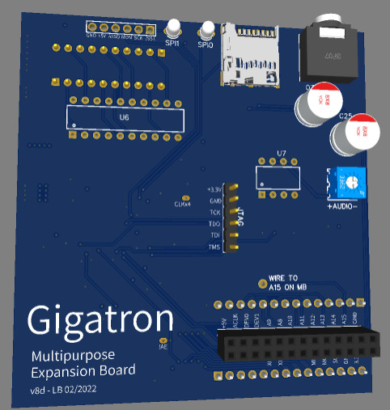

# Crazy expansion board for the Gigatron

The goal of this expansion board is to provide an easy way to experiment with crazy expansion ideas for the Gigatron.
This is work in progress. In fact this project may never go forward because it looks like an infinite time sink.

The core of the board is a ATF1508AS CPLD with a 100 pins package mediating access to a fast CY7C1049G 512KB static ram.
This static ram is fast enough to carry out multiple read and writes during each Gigatron cycle. One of them
can be used to serve the Gigatron memory requests, the other ones can be used for many purposes
such as generating the video signal while keeping the Gigatron CPU free for other tasks,
possibly with a higher resolution than the normal Gigatron.
Of course all depends on the CPLD program that one loads on this board. The idea is to start with
a simple program that replicates the functionality of a normal RAM & IO expansion board, then
to add the possibility to bank all 512KB of memory --Hello Gigatron 512K,--, then to recreate
the functionality of a video repeater, then to authorize higher resolutions, etc...

The ATF1508 CPLD is not very powerful by today's standards. It can be compared to having
a dozen GAL chips of the kind I use for the RAM & IO expansion board. Its main advantage
is that it works with a 5v power supply. These chips are in fact clones of the old Altera MAX 7000 
that can be programmed in Verilog using the free Intel Quartus tool (version 13). A program called 
`pof2jed` converts the Altera files into files than can be downloaded into the ATF1508 using
the moderately priced Atmel ATDH1150 USB download cable. 
See http://forum.6502.org/viewtopic.php?f=10&t=5948 for more pointers.

The following diagram gives an overview of the board.

In addition to the CPLD and the SRAM, there is a CY2302 zero delay PLL that takes the 6.125MHz Gigatron clock
and generates two additional clocks at 2x and 4x the frequency with aligned phases. These clocks can be used
to split the Gigatron cycle into smaller parts and drive the SRAM at a faster rate.

The last chip is a 74HCT244 buffer that sits between the 8 low bits `A0..7` of the Gigatron address bus and the `RA0..7` wires
that connect the CPLD to the 8 low bits of the SRAM address bus. This was necessary the CPLD did not have enough
remaining I/O pins to receive the full Gigatron address bus on separate lines. When the 74HCT244 outputs are active,
the Gigatron `A0..7` go into both the SRAM address bus and the CPLD ports `RA0..7`. When the 74HCT244 outputs are tri-stated,
the CPLD has exclusive control of the SRAM address bus. Of course one has to be careful to tri-state these CPLD ports
and to use them as inputs when the 74HCT244 has active outputs.

The board layout places all the SMT components out-of-sign on the board underside. The visible side contains two
connectors for SPI devices using the SD Card breakout pinout, a JTAG connector to program the CPLD, 
an expansion connector with 28 pins, and a button that controls a CPLD input that is expected to tri-state
the CPLD ports connected to the Gigatron BUS. When this is the case, the Gigatron reset routine enters an infinite loop
and the CPLD can be safely reprogrammed.

