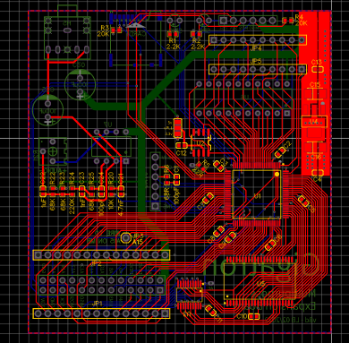

# Crazy expansion board for the Gigatron

The goal of this expansion board is to provide an easy way to
experiment with crazy expansion ideas for the Gigatron.  This is work
in progress. In fact this project may never go forward because it
looks like an infinite time sink.

## 1. Idea

The core of the board is a XC95144XL CPLD with a 100 pins package
mediating access to a fast CY7C1049G 512KB static ram.  This static
ram is fast enough to carry out multiple read and writes during each
Gigatron cycle. One of them can be used to serve the Gigatron memory
requests, the other ones can be used for many purposes such as
generating the video signal while keeping the Gigatron CPU free for
other tasks, possibly with a higher resolution than the normal
Gigatron.  Of course all depends on the CPLD program that one loads on
this board. The idea is to start with a simple program that replicates
the functionality of a normal RAM & IO expansion board, then to add
the possibility to bank all 512KB of memory --Hello Gigatron 512K,--,
then to recreate the functionality of a video repeater, then maybe to
authorize higher resolutions, etc...

This CPLD is not very powerful by today's standards. The datasheet
describes it as roughly comparable to eight 54v18 GALs. Its main
advantage is that it has 5v-tolerant i/o pins and is well supported by
old versions of the Xilinx tools which are freely available. An
alternative design (v8a) uses an ATF1508 which is a true 5v part that
is normally cheaper. While the ATF1508 may be a bette fit, in these
times of chip shortages, what matters is what is available.  The
following diagram gives an overview of the board.


In addition to the CPLD and the SRAM, there is a CY2302 zero delay PLL
that takes the 6.25MHz Gigatron clock and generates two additional
clocks at 2x and 4x the frequency with aligned phases. These clocks
can be used to split the Gigatron cycle into smaller parts and drive
the SRAM at a faster rate.

The last chip is a 74HCT244 buffer that sits between the 8 low bits
`A0..7` of the Gigatron address bus and the `RA0..7` wires that
connect the CPLD to the 8 low bits of the SRAM address bus. This was
necessary the CPLD did not have enough remaining I/O pins to receive
the full Gigatron address bus on separate lines. When the 74HCT244
outputs are active, the Gigatron `A0..7` go into both the SRAM address
bus and the CPLD ports `RA0..7`. When the 74HCT244 outputs are
tri-stated, the CPLD has exclusive control of the SRAM address bus. Of
course one has to be careful to tri-state these CPLD ports and to use
them as inputs when the 74HCT244 has active outputs.


## 2. Layout

The board layout places all the SMT components out-of-sight on the
back side od the board. The visible side contains two connectors for
SPI devices using the SD Card breakout pinout, a JTAG connector to
program the CPLD, an expansion connector with 28 pins, and a good old
74HCT377 near the OUT register which is there for nostalgia and also
because it was available.




## 3. Usage

Althouth the extension header has more signals and a different layout,
this board is backward compatible with the latest version "dual drive"
of the [GAL based extension board](../extension-retro). The following
text only describes the features that are specific to this
board. Nothing here is guaranteed to last as this is work in progress.

## 3.1. Extended banking "Gigatron 512K"

The goal was to provide ways to use all 512K of memory while remaining
maximally compatible with software that knows only about the four
banks scheme of the typical memory expansion boards, which relies on
[normal ctrl codes](https://forum.gigatron.io/viewtopic.php?f=4&t=331)
that `SYS_ExpanderControl` also saves in the `ctrlBits_v5` memory
location (0x1f8). These only have provision for four banks. Yet
software typically expects to be able to save and restore a banking
configuration by copying and manipulating `ctrlBits_v5`.

The chosen solution was to introduce two new four-bits banking
registers named `NBANKR` and `NBANKW` that separately determine wich
bank is read or written when the CPU accesses an address in range
0x8000 to 0xFFFF. When these registers are zero, or when the CPU
accesses an address in range 0x0000 to 0x7FFF, the target bank is
chosen as with the GAL based expansion board on the basis of the bits
`BANK0`, `BANK1`, and `/ZPBANK` set with normal ctrl codes.

The registers NBANKW and NBANKR are set using an [extended ctrl
code](https://forum.gigatron.io/viewtopic.php?f=4&t=331) with device
address 0xF. The value of `NBANKW` is then read from address lines
A12-A15, and `NBANKR` from address lines A8-A11. Native code can also
read back the contents of the `NBANKW` and `NBANKR` by setting `SCLK`
and reading address 0xF0.

In short to read from bank `rbank` and write to bank `wbank`, one can use
```
  SYS_ExpanderControl( ((wbank & 0xf) << 12) | ((rbank & 0xf) << 8) | 0xF0 );
```
as illustrated in the [memory test program](test/memtest).

## 3.2. Video snooping

Work in progress

## 3.3. Double resolution

Work in progress

## 3.4. Extended audio

The center pin of the H5 header (or the XIN3 pin of the extension
header on earlier boards) outputs an average voltage in range 0.0 to
3.3V that depends linearly on the six upper bits of the last extended
control code for device 13.  In other words,
```
  SYS_ExpanderControl( (x<<10) | 0XD0 );
```
sets an average voltage of x * 3.3 / 64 volts. This is achieved with
reverse bit pwm scheme whose noise affects frequencies above 50kHZ. It
is expected that the patched ROM will duplicate the Gigatron audio
signal to the PWM header.  Therefore it is recommended to use a 7 kHZ
low pass filter before sending this signal to a speaker.

