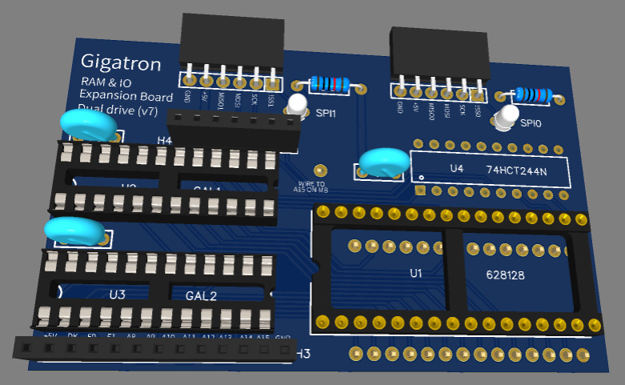

# Warning: $`\text{\color{red} consider Hans61's simple board instead!}`$

This ram-and-io expansion board for the Gigatron is not a bad design, but its advanced features are not that useful, and it is much harder to build than Hans61's recreation of the original ram-and-io expansion board designed by Marcel. See [this forum link](https://forum.gigatron.io/viewtopic.php?p=3694&hilit=hans61+recreated#p3694) and [this github link](https://github.com/hans61/Gigatron-TTL/tree/main/Expansion128k). I recommend the dual-driver version of Hans61's board.


# Gigatron RAM and IO expansion (v7, "dual drive")

This is the latest version of the GAL-based 128KB RAM and IO extension for the Gigatron. This board is compatible enough with [Marcel's design](https://forum.gigatron.io/viewtopic.php?f=4&t=64&start=50#p804) to require no change to the Gigatron software. It provides the usual features of GAL-based expansion boards.
* Zero page banking provides means to select a different memory bank for the zero page range 0x80-0xff.
* SPI clock polarity control allows for implementing [SPI modes](https://en.wikipedia.org/wiki/Serial_Peripheral_Interface#Clock_polarity_and_phase) (CPOL, CPHA). Modes 0 and 2 are supported with the existing firmware. Modes 1 and 3 can be implemented with a new native routine.

This version of the board also provides useful additional features:
* Two SPI headers simultaneously usable with [most cheap SD Card breakouts with 5v level shift](https://www.amazon.com/HiLetgo-Adater-Interface-Conversion-Arduino/dp/B07BJ2P6X6), working around the poor SPI compliance of both SD Cards and breakouts. Signals to create more SPI ports are provided on header H4 (7 pins).
* Support for the [extended CTRL codes](https://forum.gigatron.io/viewtopic.php?f=4&t=331). Such codes will not affect the banking state or SPI state but will be exposed on header H3 (13 pins). The main motivation for this new version of the board was to demonstrate how to redistribute the board functions between the two GAL chips. This turned out to be more space efficient and to leave space for more features.




## 1 - Building and installing the expansion board.

### 1.1 - PCB and components

You can easily order PCBs by giving `Gerber_PCB-v7.zip` to your preferred provider. 
I got mine from JLCPCB. If you want to change things, investigate the `easyeda` subdirectory.
The list of components can be found in file `BOM-v7.csv`. The trickiest part is to select the pin headers that are located on the reverse side of the board and should plug into the RAM socket on the gigatron motherboard. Most pin headers are too thick. The best soluton I found were relatively expensive Preci-Dip headers with a thin side and a thick side. 

### 1.2 - Programming the GALs

The ATF22V10C GALs are supported by the same cheap [XGecu TL866IIplus](https://www.amazon.com/s?k=tl866ii+plus+programmer) programmer I use to program the Gigatron ROM. Note that you need the new version TL866II+. The old TL866 cannot program those chips. The files `cupl/GAL1.pld` and `cupl/GAL2.pld` describe the logic equations. You do not need to compile them with Atmel's finicky [WinCUPL](https://www.microchip.com/en-us/products/fpgas-and-plds/spld-cplds/pld-design-resources) program because the repository contains the two output files `cupl/GAL1-v7.jed` and `cups/GAL2-v7.jed` that must be programmed into the GALs. This can be done using XGecu's Windows software or using [minipro](https://gitlab.com/DavidGriffith/minipro) on Linux:
```
    $ minipro -p atf22v10c -w GAL1-v7.jed  ### for the first GAL
    $ minipro -p atf22v10c -w GAL2-v7.jed  ### for the second GAL
```
Mark the GALs because you do not want to swap them.


### 1.3 - Assembling and installing the board

This is not going to be too hard for those who have already built their Gigatron. It is wise to use sockets for the two GALs (in case you want to reprogram them) and the SRAM. Start with the capacitors. Then plug the bottom headers on a spare IC socket to make sure they have the right position and solder them on the back side of the board. Then solder the SRAM socket, the GAL sockets, the top side headers, the diodes, the resistors, and the 74HCT244. The board plugs in socket of the 32KB Gigatron SRAM. Do not forget to wire the A15 point on the Gigatron board to the A15 header on the board. I am using little horizontal 1x1 pin headers on both the Gigatron board and the expansion board, connected by a short breadboard wire.


## 2 - Programming with the expansion board

Like Marcel's board, this board adds a new native instruction `ctrl` to the Gigatron that smartly repurposes nonsensical opcodes that try to simultaneously read and write the RAM. This instruction is supported by the assembler and can be found in a couple places in the ROM. Its arguments are similar to the arguments of a store instruction, but without the brackets as the sixteen bits address bus is used to carry the argument instead of a memory address. 

Here how the ROMv5a initializes Marcel's extension board:
```
# Setup I/O and RAM expander
ctrl(0b01111100)                # Disable SPI slaves, enable RAM, bank 1
#      ^^^^^^^^
#      |||||||`-- SCLK
#      ||||||`--- Not connected
#      |||||`---- /SS0
#      ||||`----- /SS1
#      |||`------ /SS2          # In this board, /SS2 is repurposed as /CPOL
#      ||`------- /SS3          # In this board, /SS3 is repurposed as /ZPBANK
#      |`-------- B0
#      `--------- B1
# bit15 --------- MOSI = 0
```
This board only provides two SPI channels but makes them far more robust. It repurposes the device selection bits `/SS2` and `/SS3` to implement new functionalities: Bit 4 becomes `/CPOL` to implement the missing SPI modes. Bit 5 becomes `/ZPBANK` to offer memory banking in the upper half of page zero.
Note that only native code can use the `ctrl` instruction. In order to avoid glitches that can write data in random memory position, each ctrl instruction in native code must be followed by either a memory load or another ctrl instruction. In contrast, vCPU programs can use safe SYS extensions such as:
* `SYS_ExpanderControl_v4_40` calls `ctrl` with the contents of `vAC`.
* `SYS_SpiExchangeBytes_v4_134` exchanges bytes with a SPI device.
* `SYS_CopyMemoryExt_DEVROM_100` copies data across memory banks.

### 2.1 - Memory banking

In Marcel's original design, the 128K of memory are divided in four banks of 32K.  Bank 0 is always accessible at addresses 0x0000 to 0x7fff (low addresses). Meanwhile, the bits `B1` and `B0` of the `ctrl` instruction define which bank is accessible at addresses 0x8000 to 0xffff (high addresses). For instance, selecting bank 0 (`B1=0,B0=0`) emulates a 32K Gigatron by aliasing the low and high memory addresses. The default setup, bank 1 (`B1=0,B0=1`) emulates a 64K Gigatron by providing a fresh 32K of memory in the high addresses. Banks 2 and 3 remain available to programs that know how to swap stuff.

One of the ideas discussed by Marcel was to hide the Gigatron OS in banked memory so that programs that didn't know its existence would be able to run unfazed. However this is difficult to achieve because the VCPU code and the GCL language is very  dependent on placing variables and subroutine addresses in page zero. The new VCPU instruction `CALLI` was specifically added to avoid cluttering page zero with subroutine addresses. But what to do with the variables?  This board provides a solution by using the memory banking system to swap what is visible in the upper part of page zero. When `/ZPBANK` bit is set, the board works exactly as Marcel's. Clearing `/ZPBANK` logically swaps the address regions `[0080-00ff]` and `[8080-80ff]`. This means that the memory visible at addresses `[0080-00ff]` comes from the bank specified by the bits `B1` and `B0` whereas the memory visible at addresses `[8080-80ff]` always comes from bank 0.  One has to be careful because the program stack also lives in the upper part of the page zero. The plan is to use this feature to provide operating system routines whose code hides in page 3 and whose zero page footprint is hidden from the running program.

### 2.2 - SPI

In Marcel's design, SPI transactions are performed by first selecting a slave by clearing one of the `/SS[0..3]` bits using `SYS_ExpanderControl_v4_40`, then calling the `SYS_SpiExchangeBytes_v4_134` function which bangs the `SCLK` and `MOSI` bits to send bits to the slave device and simultaneously receives bits from the slave device on the MISO lines. The gigatron cpu can read the MISO lines because, when `SCLK` is set, reading from memory does not return what is at the specified address but returns a byte whose four low bits are read from the MISO lines for the four channels. This is about the only thing you can do when `SCLK` is set because the variables are inaccessible. This might be why the current code does not even try to select to correct MISO line for the selected channel. It instead assumes that the inactive lines are kept low using a pull down resistor. This is problematic in theory because, according to the specifications, using a SD card in SPI mode requires pull up resistors. This even more problematic in practice because SD Cards and SD breakouts can be very sloppy.

This board offers only two SPI channels. Each channel has separate MISO lines named `MISO0` and `MISO1`. A third line `MISOX` is wired to header H4 to permit the implementation of more SPI ports. When not driven, the state of these lines is determined by the pin-keeper feature of the GALs. To read the state of the active MISO line, native code must set `SCLK` and read a byte from address zero. Bits 1,2,3 are always zero. The state of bit 0 depends on which SPI port is selected: when `/SS0` is asserted, this is `MISO0`; when `/SS1` is asserted, this is `MISO1`, when neither are asserted, this is `MISOX` to permit the addition of more SPI ports using header H4. Reading from any nonzero address shows what is in memory regardless of `SCLK`, which means that we can still do useful things when `SCLK` is set. Since this is compatible with the existing firmware, vCPU programs can simply use `SYS_SpiExchangeBytes_v4_100`.

* The clock signal sent to the SPI devices is not `SCLK` but `SCK` which is a XOR of `SCLK` and `CPOL`. Since `/CPOL` is set by default, exchanging bytes with `SYS_SpiExchangeBytes_v4_134` implements [SPI mode 0 (CPHA=0,CPOL=0)](https://en.wikipedia.org/wiki/Serial_Peripheral_Interface#Mode_numbers). Clearing `/CPOL` inverts the clock signal and therefore implementing SPI mode 2 (CPHA=0,CPOL=0). Modes 1 and 3 are subtly different and require a slightly different SYS function. This new function should toggle `/CPOL` before transfering each byte, then continue as the current function. However, after exchanging the last bit of the byte, the function should not clear `SCLK`, but simultaneously clear `SCLK` and toggle `/CPOL` to restore the original control word. This is easy to achieve because we can read the CtrlBits variable at address 01f8 despite `SCLK` being set.

### 2.3 - Extended CTRL codes

The sixteen bits value presented on the address bus during the execution of a CTRL instruction are called CTRL codes. Altough the normal CTRL codes discussed above leave very little room for expansion, [extended CTRL codes](https://forum.gigatron.io/viewtopic.php?f=4&t=331) exploit the fact that normal CTRL codes do not typically select SPI devices 0 and 1 at the same time. Extented CTRL codes have the format '0b`YYYYYYDDDD00XX` where `YYYYYYYY` represents a 8 bits payload for device `DDDD`. When the board recognizes such a CTRL code, it does not change the banking state or the SPI state. Instead it sets signal `/AUXCTRL` to zero and provides two device address decoding lines named `/AUXDEV0` and `/AUXDEV1` associated with device numbers `0000` and `0001`. These signals, as well as A8-A15, are exposed on header H3 (with short names CK,F0, F1). 

Here are two examples

* A single 74HCT377 can provide eight output bits: connect pins `D[1..8]` to the address lines `A[8..15]`, pin `CLK` to `/AUXCTRL`, pin `/G` to `/AUXDEV0`. The state of pins `Q[1..8]` can then be simultaneously changed with a single `ctrl(0xYY00)` instructions. Alternatively, one can implement up to 64 individually selected binary outputs by using a 74HCT137 demultiplexer to decode bits A8-A10 three bits with output enable pins connected to /AUXDEV0 and /AUXCTRL. This demultiplexer can control up to eight 74HCT259 that decode A11-A13 and latch A15.
* Output bits implemented in this way can be used for various purposes, including as chip select for additional SPI ports. The remaining SPI signals can be found on header H4. Note that such SPI device must be careful to never drive the common MISO line at the same time.  
* A single TLC7524C can provide a 8 bit analog signal: connect pins `DB[0..7]` to `A[8..15]`, pin `/CS` to `/AUXDEV1`, and pin `/WR` to `/AUXCTRL`. For instance, using the somehow counter-intuitive "voltage mode" of the chip, using instruction `ctrl(0xYY10)` will set the voltage of pin `REF` to a value that interpolates the voltages provided on pins `OUT0` and `OUT1`.  

Note that the extended CTRL code specification also defines codes with both bits 0 and 1 set as a reset signal. This is not implemented or decoded by this board.


# 2.4 - Detecting different boards

Native code can distinguish the kind of memory extension by setting `SCLK` and checking the byte read at address zero:

* Marcel's original expansion board design leaves bits 4 to 7 left floating. 
* GAL-based boards only return input data when reading from address zero. For instance, reading from address 0x1f0 while SCLK is set should still return 0x59 because this is the opcode of the first instruction of the reset code.
* Version 6 GAL-based boards set bits 4 to 7 to zero.
* Version 7 GAL-based boards connect bits 6 and 7 to the banking bits of the CTRL word. Bits 4 and 5 are connected to pins INP0 and INP1 of header H4.

Detecting the presence of an expansion board is best left to the `Reset.gcl` code because using the ctrl instruction when no board is present can write random data in the memory address corrresponding to the ctrl code. Since ROMv5a, the reset code sets the byte at adddress 0x1f8 to zero when no board is present. Otherwise the ROM keeps this byte equal to the low eight bits of the latest standard control code.


# 2.5 - Erratum

Lines A8 and A9 were swapped. This was fixed in v7b by changing the serif on the extension header.

