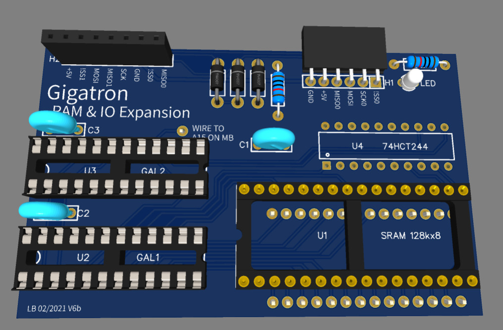

# Gigatron RAM and IO expansion (v6)


This is a 128KB RAM and IO extension that is compatible enough with [Marcel's design](https://forum.gigatron.io/viewtopic.php?f=4&t=64&start=50#p804) to boot simple programs from a SD card connect to the SPI0 bus. Compared to Marcel's design, this version has support for the [various SPI modes](https://en.wikipedia.org/wiki/Serial_Peripheral_Interface#Clock_polarity_and_phase) (CPOL, CPHA) and has support for banking the upper half of the zero page for [reasons discussed here](https://forum.gigatron.io/viewtopic.php?p=2014#p2014).

Like my [earlier design](https://forum.gigatron.io/viewtopic.php?p=2011), this extension board has a convenient header to plug a [cheap micro-SD breakout board](https://www.amazon.com/gp/product/B07MTTLF75). However, its implementation is substantially different. It relies on a single 74hct244 and two ATF22V10C GALS, just like in the eighties. This makes the board a bit bigger (80x50mm instead of 50x55mm) but more Gigatron-like. I am still thinking of a compact CPLD based version (see the `extension-compact` directory) but this only makes sense if one gets something extra from such a design.

## 1 - Building and installing the expansion board.

### 1.1 - PCB

You can easily order PCBs by giving `Gerber_PCB-v6.zip` to your preferred provider. 
I got mine from JLCPCB (five boards for $3.10 plus shipping).
If you want to change things, investigate the `easyeda` subdirectory.

### 1.2 - Components

The list of components can be found in file `BOM.csv`. The trickiest part is to select the pin headers that are located on the reverse side of the board and should plug into the RAM socket on the gigatron motherboard. Most pin headers are too thick. The best soluton I found were relatively expensive Preci-Dip headers with a thin side and a thick side. If you have a Digi-Key account, you can use [this link](https://www.digikey.com/BOM/Create/CreateSharedBom?bomId=8557252) to see exactly what I got from them.

### 1.3 - Programming the GALs

The ATF22V10C GALs are supported by the same cheap XGecu TL866IIplus I use to program the Gigatron ROM. The files `cupl/GAL1.pld` and `cupl/GAL2.pld` describe the logic equations. You do not need to compile them with Atmel's finicky [WinCUPL](https://www.microchip.com/en-us/products/fpgas-and-plds/spld-cplds/pld-design-resources) program because the repository contains the two output files `cupl/GAL1.jed` and `cups/GAL2.jed` that must be programmed into the GALs. This can be done using XGecu's Windows software or using [minipro](https://gitlab.com/DavidGriffith/minipro) on Linux:
```
    $ minipro -p atf22v10c -w GAL1.jed  ### for the first GAL (the south one)
    $ minipro -p atf22v10c -w GAL2.jed  ### for the second GAL (the north one)
```
Mark the GALs because you do not want to swap them.


### 1.4 - Soldering the components

This is not going to be too hard for those who have already built their Gigatron. It is wise to use sockets for the two GALs (in case you want to reprogram them) and the SRAM. Start with the capacitors. Then plug the bottom headers on a spare IC socket to make sure they have the right position and solder them on the back side of the board. Then solder the SRAM socket, the GAL sockets, the top side headers, the diodes, the resistors, and the 74HCT244.

### 1.5 - Installing the board

Do not forget to wire the A15 point on the Gigatron board to the A15 header on the board. I am using little horizontal 1x1 pin headers on both the Gigatron board and the expansion board, connected by a short breadboard wire.


## 2 - What works

The 128K RAM extension should be detected by the Gigatron ROMv4, ROMV5a, and DevRom. Many programs such as TinyBasic or MSBasic can use 64K of them.

Booting from the SD requires the DevRom because of a one byte error in ROMv5a. Note that this is a very experimental code. It only works with a FAT32 formatted SDCard and only boots the program named `SYSTEM.GT1` found in the first partition. I was able to boot short program such as Blinky or Hello World by renaming them `SYSTEM.GT1`. Something seems broken for longer programs.

## 3 - Programming with the expansion board

Like Marcel's board, this board adds a new native instruction `ctrl` to the Gigatron that smartly repurposes nonsensical opcodes that try to simultaneously read and write the RAM. This instruction is supported by the assembler and can be found in a couple places in the ROM. Its arguments are similar to the arguments of a store instruction, but without the brackets as the address bus is used to carry the argument instead of a memory address. 

Here how the ROMv5a initializes Marcel's extension board:
```
# Setup I/O and RAM expander
ctrl(0b01111100)                # Disable SPI slaves, enable RAM, bank 1
#      ^^^^^^^^
#      |||||||`-- SCLK
#      ||||||`--- Not connected
#      |||||`---- /SS0
#      ||||`----- /SS1
#      |||`------ /SS2          # In this board, /SS2 is repurposed as /CPOL
#      ||`------- /SS3          # In this board, /SS3 is repurposed as /ZPBANK
#      |`-------- B0
#      `--------- B1
# bit15 --------- MOSI = 0
```
My board only provides two SPI channels. It repurposes the device selection bits `/SS2` and `/SS3` to implement new functionalities: Bit 4 becomes `/CPOL` to implement the missing SPI modes. Bit 5 becomes `/ZPBANK` to offer memory banking in the upper half of page zero.

Note that only native code can use the `ctrl` instruction. VCPU programs must use SYS extensions. ROMv5a already provides two of them:

* `SYS_ExpanderControl_v4_40` calls `ctrl` with the contents of `vAC`.
* `SYS_SpiExchangeBytes_v4_134` exchanges bytes with a SPI device.


### 3.1 - Memory banking

In Marcel's original design, the 128K of memory are divided in four banks of 32K.  Bank 0 is always accessible at addresses 0x0000 to 0x7fff (low addresses). Meanwhile, the bits `B1` and `B0` of the `ctrl` instruction define which bank is accessible at addresses 0x8000 to 0xffff (high addresses). For instance, selecting bank 0 (`B1=0,B0=0`) emulates a 32K Gigatron by aliasing the low and high memory addresses. The default setup, bank 1 (`B1=0,B0=1`) emulates a 64K Gigatron by providing a fresh 32K of memory in the high addresses. Banks 2 and 3 remain available to programs that know how to swap stuff.

One of the ideas discussed by Marcel was to hide the Gigatron OS in banked memory so that programs that didn't know its existence would be able to run unfazed. However this is difficult to achieve because the VCPU code and the GCL language is very  dependent on placing variables and subroutine addresses in page zero. The new VCPU instruction `CALLI` was specifically added to avoid cluttering page zero with subroutine addresses. But what to do with the variables?  This board provides a solution by using the memory banking system to swap what is visible in the upper part of page zero.

When `/ZPBANK` bit is set, the board works exactly as Marcel's. Clearing `/ZPBANK` logically swaps the address regions `[0080-00ff]` and `[8080-80ff]`. This means that the memory visible at addresses `[0080-00ff]` comes from the bank specified by the bits `B1` and `B0` whereas the memory visible at addresses `[8080-80ff]` always comes from bank 0.  One has to be careful because the program stack also lives in the upper part of the page zero. But this is going to change with at67's new ROM that can relocate the stack anywhere in the Gigatron memory.

Here are two ways to use this feature:

* The Gigatron OS could provide a VCPU entry point in 0x8080. Calling this subroutine would switch to bank 3 in both high memory and upper zero page (`B1=1`, `B0=1`, `/ZPBANK=0`), save the stack pointer, setup a new stack, and call the appropriate OS routine in the upper address area. When the routine returns, it would restore both the stack pointer and the initial bank. The OS routine is then free to use any zero page location in range 0x81-0xff with confidence that nobody is going to see them or modify them between calls. 
 
* Two programs could simultaneously be active in pages 1 and 2. Each of them could rely on a private set of zero page variables in 0x81-0xff. Each of them could have a private stack. One can switch from one program to the other by simply swapping the banks and refreshing the screen.


### 3.2 - SPI

In Marcel's design, SPI transactions are performed by first selecting a slave by clearing one of the `/SS[0..3]` bits using `SYS_ExpanderControl_v4_40`, then calling the `SYS_SpiExchangeBytes_v4_134` function which bangs the `SCLK` and `MOSI` bits to send bits to the slave device and simultaneously receives bits from the slave device on the MISO lines. The gigatron cpu can read the MISO lines because, when `SCLK` is set, reading from memory does not return what is at the specified address but returns a byte whose four low bits are read from the MISO lines for the four channels. This is about the only thing you can do when `SCLK` is set because the variables are inaccessible. This might be why the current code does not even try to select to correct MISO line for the selected channel. It instead assumes that the inactive lines are kept low using a pull down resistor. This is problematic because, according to the specifications, using a SD card in SPI mode requires pull up resistors. 

My board differs from this design in three ways.

* There only two SPI channels and their MISO lines have a pull up resistor. 
* To read the MISO lines, one has to set `SCLK` and read address zero. If the SPI0 channel is selected, its MISO line appears on bit 2. If the SPI1 channel is selected, its MISO lines appears on bit 3. All other bits are zero meaning that Marcel's code works unmodified despite the presence of pull up resistors. Meanwhile, reading from any nonzero address shows what is in memory regardless of `SCLK`. This means that we can still do useful things when `SCLK` is set.
* Finally the clock signal sent to the device is not `SCLK` but `SCK` which is a XOR of `SCLK` and `CPOL`. Since `/CPOL` is set by default, exchanging bytes with `SYS_SpiExchangeBytes_v4_134` implements [SPI mode 0 (CPHA=0,CPOL=0)](https://en.wikipedia.org/wiki/Serial_Peripheral_Interface#Mode_numbers). Clearing `/CPOL` inverts the clock signal and therefore implementing SPI mode 2 (CPHA=0,CPOL=0). Modes 1 and 3 are subtly different and require a slightly different SYS function. This new function should toggle `/CPOL` before transfering each byte, then continue as the current function. However, after exchanging the last bit of the byte, the function should not clear `SCLK`, but simultaneously clear `SCLK` and toggle `/CPOL` to restore the original control word. This is easy to achieve because we can read the CtrlBits variable at address 01f8 despite `SCLK` being set.
That all for today.

## 4 - Final

I almost forgot the little LED that flashes when the SD card is active.
